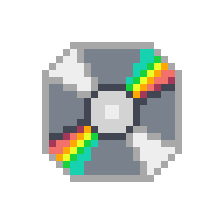

  

  

  

## I'm an IT engineering student
- 🎓 I am currently studying a double diploma in IT engineering and computer science at ESIR (Rennes School of Engineering) and at the University of Quebec in Chicoutimi (UQAC)
- 💻 I am passionate about programming, software development, and technology in general
-   Dev from France, Brittany
- 🌐 Find more about me [here](https://sgabriel.fr)

## You can find me on

   &nbsp;
   &nbsp;
   &nbsp;
  

## Programming Languages I Know

  

## Frameworks & Libs I Use

  

## Tools I Work With

  

  

